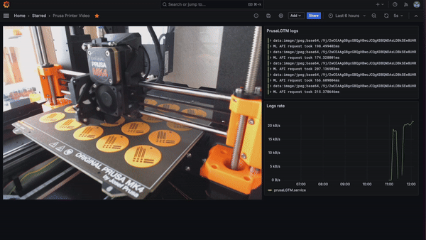

# Prusa LGTM: Prusa looks good to me

This helps monitor your Prusa printer by taking regular screenshots and storing them in [Loki](https://grafana.com/oss/loki/). This lets you visualise your prints in Grafana.



## Getting Started

### Prerequisites

* A Linux Machine
* WebCam pointing at your printer
* Ability to send logs to Loki (see: https://grafana.com/docs/loki/latest/send-data/)
* (optional) Your linux user that is part of the `video` group. If not, run it with sudo.

### Install

Please find the right binary for your device here: https://github.com/gouthamve/prusaLGTM/releases/latest

### Running PrusaLGTM to monitor your printer

```
./prusaLGTM print-image
```

This should now start logging the image to stdout.


## Commands

### print-image

```
Usage: prusaLGTM print-image [flags]

Print images from a camera to stdout.

Flags:
  -h, --help                           Show context-sensitive help.
      --prometheus-port=8366           The port to expose Prometheus metrics on.

      --max-log-size=256000            Maximum bytes of the image to be logged. Set it to lower than Loki log line limit
      --max-image-size=1080            Maximum size of the image to be logged in pixels.
      --prusa-link-url=                The URL to PrusaLink. When provided we only log images when there is a print job ongoing.
      --ml-api-url=STRING              EXPERIMENTAL: The URL to the ML API to detect failures.
      --camera-device="/dev/video0"    The video device to use.
      --format=FORMAT
      --camera-frame-width=2304        The width of the frame.
      --camera-frame-height=1536       The height of the frame.
      --camera-frame-rate=2.0          The frame rate of the camera.
      --camera-picture-interval=10s    The interval at which to take pictures.
```

### generate-timelapse

```
Usage: prusaLGTM generate-timelapse --loki-url=STRING --start-time=TIME --end-time=TIME [flags]

Generate a timelapse video from the print images.

Flags:
  -h, --help                                                        Show context-sensitive help.
      --prometheus-port=8366                                        The port to expose Prometheus metrics on.

      --loki-url=STRING                                             The URL to the Loki API to fetch logs from.
      --loki-username=STRING                                        The username to authenticate with the Loki API.
      --loki-password=STRING                                        The password to authenticate with the Loki API.
      --logql-query="{unit=\"prusaLGTM.service\"} |= \"base64\""    The LogQL query to fetch logs.
      --start-time=TIME                                             The start time of the logs to fetch.
      --end-time=TIME                                               The end time of the logs to fetch.
      --encode-to-mp4                                               Whether to encode the timelapse to MP4. Requires ffmpeg
      --output-path="videos/"                                       The path to save the timelapse video.
```